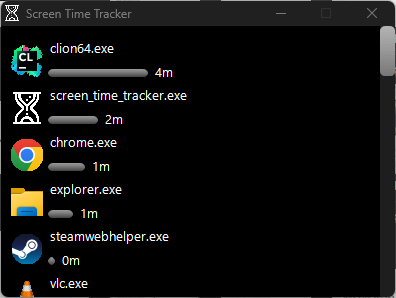

# Screen Time Tracker

A lightweight Windows application that tracks the active time you spend on different applications. It provides a visual representation of your usage, helping you monitor and manage your screen time effectively.



## Table of Contents

- [Features](#features)
- [Prerequisites](#prerequisites)
- [Installation](#installation)
- [Building from Source](#building-from-source)

## Features

- **Real-Time Tracking**: Monitors active application usage in real-time.
- **Visual Representation**: Displays usage statistics with application icons, names, and time spent.
- **Minimalistic UI**: A compact and sleek interface that blends with the Windows environment.
- **System Tray Integration**: Minimizes to the system tray with options to pause, resume, or exit.
- **DPI Awareness**: Scales appropriately according to system DPI settings.
- **Dark Mode Support**: Integrates with Windows dark mode for a seamless look.

## Prerequisites

- **Operating System**: Windows 7 or later (Windows 10 or 11 recommended for full feature support).
- **Dependencies**:
    - **GDI+**: Included with Windows.
    - **Windows SDK**: For necessary headers and libraries.

## Installation

### **Download the Latest Release**

1. **Visit the [Releases](https://github.com/yourusername/screen-time-tracker/releases) page**.
2. Download the file **`screen-time-tracker-1.0.0.zip`**.
3. Extract the contents of the ZIP file to a folder of your choice.

### **Run the Application**

Double-click `screen_time_tracker.exe` to start tracking your screen time.

## Building from Source

### **Prerequisites**

- **Development Tools**:
    - [CMake](https://cmake.org/) 3.10 or higher.
    - C++ Compiler:
        - **MinGW-w64** (GCC)
        - **Microsoft Visual C++ (MSVC)**
- **Libraries**:
    - GDI+ (included with Windows)
    - Windows SDK

### **Clone the Repository**

```bash
git clone https://github.com/yourusername/screen-time-tracker.git
cd screen-time-tracker
