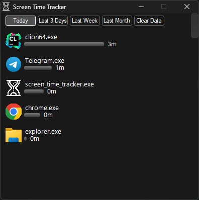

# Screen Time Tracker

_Disclaimer: This project is intended for personal use to help monitor screen time. It does not collect or transmit any personal data._

A lightweight Windows application that tracks the active time you spend on different applications. It provides a visual representation of your usage, helping you monitor and manage your screen time effectively.



## Table of Contents

- [Features](#features)
- [Prerequisites](#prerequisites)
- [Installation](#installation)
- [Building from Source](#building-from-source)

## Features

- **Real-Time Tracking**: Monitors active application usage in real-time.
- **Visual Representation**: Displays usage statistics with application icons, names, and time spent.
- **Time Range Filters**: Switch between tracking **Today**, **Last 3 Days**, **Last Week**, or **Last Month** to analyze usage across different time spans.
- **Animated Usage Bars**: Smooth transitions for application usage bars to show app activity more dynamically.
- **Minimal Bar Width**: Ensures visibility of all apps even if usage time is very low.
- **Filter Highlighting**: The selected time range filter button is highlighted for clarity.
- **Custom Scrollbar**: A sleek scrollbar with a draggable thumb for smooth navigation.
- **Darker UI Theme**: Updated, darker theme for the usage bars and scrollbar, enhancing the look in dark mode.
- **System Tray Integration**: Minimizes to the system tray with options to pause, resume, or exit.
- **DPI Awareness**: Scales appropriately according to system DPI settings.
- **Dark Mode Support**: Integrates with Windows dark mode for a seamless look.

## Prerequisites

- **Operating System**: Windows 7 or later (Windows 10 or 11 recommended for full feature support).
- **Dependencies**:
    - **GDI+**: Included with Windows.
    - **Windows SDK**: For necessary headers and libraries.

## Installation

### **Download the Latest Release**

1. **Visit the [Releases](https://github.com/evsalik/screen_time/releases) page**.
2. Download the file **`screen-time-tracker-1.0.0.zip`**.
3. Extract the contents of the ZIP file to a folder of your choice.

### **Run the Application**

Double-click `screen_time_tracker.exe` to start tracking your screen time.

## Building from Source

### **Prerequisites**

- **Development Tools**:
    - [CMake](https://cmake.org/) 3.10 or higher.
    - C++ Compiler:
        - **MinGW-w64** (GCC)
        - **Microsoft Visual C++ (MSVC)**
- **Libraries**:
    - GDI+ (included with Windows)
    - Windows SDK

### **Clone the Repository**

```bash
git clone https://github.com/evsalik/screen_time.git
cd screen_time
